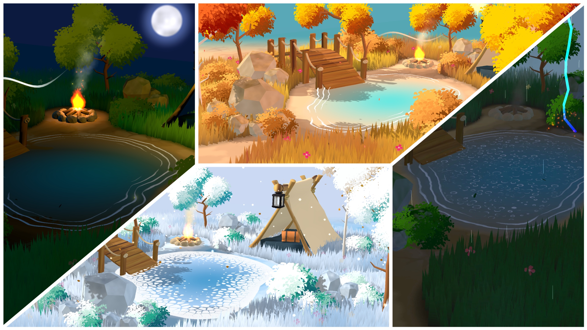

# Elemental Serenity



A Stylized Diorama with WebGL and Three.js

## Installation

```bash
npm install
```

## Usage

### Development

```bash
npm run dev
```

### Build

```bash
npm run build
```

### Preview Production Build

```bash
npm run preview
```

### Debug Mode

Add `?mode=debug` to the URL to enable debug mode with additional console logging and performance monitoring.

## Project Structure

```
src/
├── config/          # Asset configuration and settings
├── Game/            # Core game classes and systems
│   ├── Core/        # Renderer and camera
│   ├── UI/          # UI components and manager
│   ├── Utils/       # Utility classes
│   └── World/       # World components and managers
├── Shaders/         # GLSL shader files
└── Styles/          # SCSS stylesheets
```
